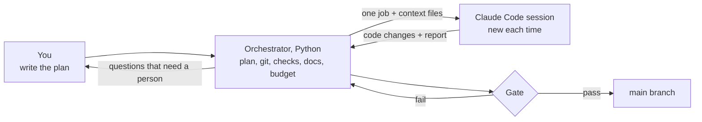
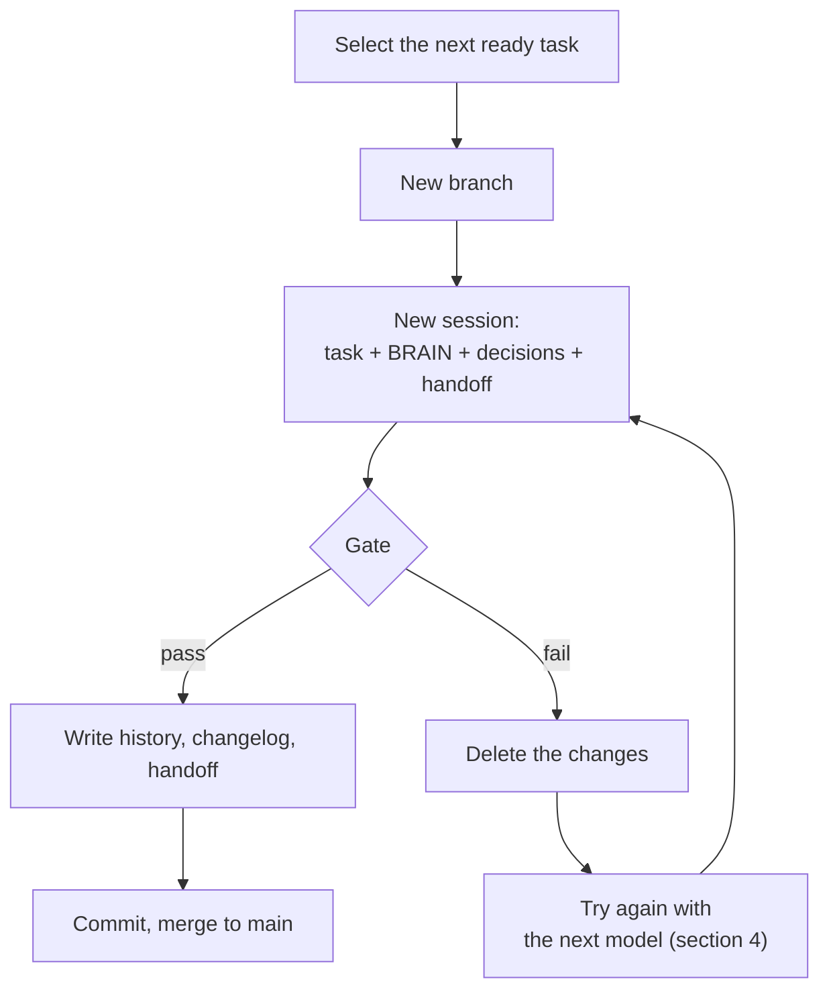
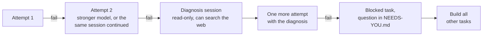
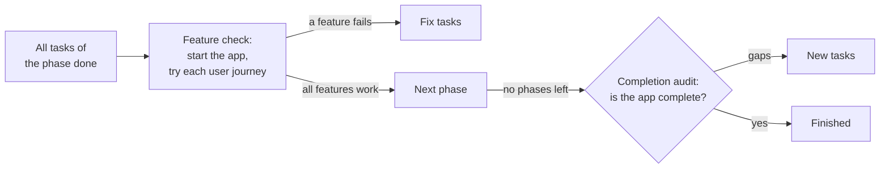
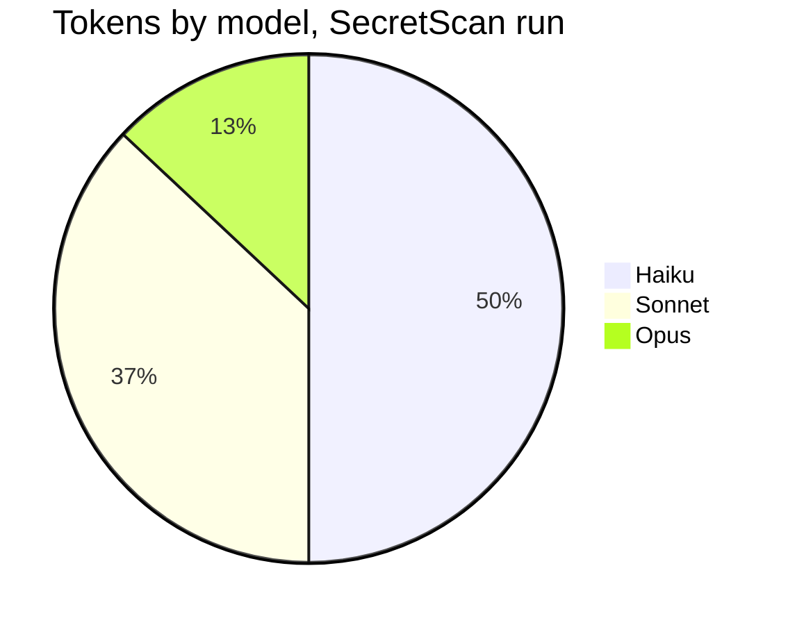

# Autopilot architecture

This page explains how Autopilot works and why. The main idea: **the AI model writes the code, and Python code
decides what to keep.**

For the steps to use Autopilot, read the [tutorial](GUIDE.md). For all commands and settings, read the
[reference](REFERENCE.md).

## 1. Who does what

| Part | Controls |
|---|---|
| **Orchestrator** | The plan, the progress, all git commands, the checks, the docs, the deploys, the model choice, and the budget |
| **Claude Code session** | One job: the code for one task, or one review |
| **You** | The plan. Later: the answers in `docs/NEEDS-YOU.md` and the production approvals |

## 2. Life of one task

## 3. The gate

The orchestrator runs the gate after each task. It never accepts the "done" message of the agent as proof.

| Check | Finds | Result |
|---|---|---|
| Build, lint, typecheck, tests | A command from your settings that fails | Fail |
| Test-tamper guard | A deleted, skipped or empty test, weaker test settings, or a changed CI file | Fail |
| Secret scan | An added line that looks like a key, a token, or a password | Fail |
| Protected files | Changes to the plan, the settings, or the questions file | Fail |
| Empty diff | No change | Fail |
| Scope | Changes outside the files of the task | Warning |

The agent gets these rules before it starts, so it can obey them on the first attempt.

## 4. When a task fails

The run never stops for one task.

## 5. When a phase or the plan is complete

## 6. Models: low cost first, stronger when necessary

| Task risk | Attempt 1 | Attempt 2 | Attempt 3 |
|---|---|---|---|
| Low | Haiku | Sonnet | Opus |
| Medium | Sonnet | Sonnet | Opus |
| High, critical | Opus | Opus | Opus |

A failed task goes to a stronger model, never to a weaker one. This chart shows the real share of tokens in the
SecretScan run (38 sessions):

## 7. Why each design choice

| Problem of long agent runs | Design choice |
|---|---|
| The agent forgets context after many hours | One new session for each task. The memory is in files |
| The agent says "done" when the work is not done | Python runs the checks. The agent cannot change them |
| One failed task stops all work | Retry, then a stronger model, then a blocked task. The other tasks continue |
| `main` fails its checks | A fixer session repairs `main` before new work starts |
| Risky design choices without thought | A high-risk task first compares 2 or 3 designs. The choice goes to `docs/adr/` |
| Missing parts at the end | The completion audit adds fix tasks |
| A deploy fails | A health check, an automatic rollback, and a fix task |
| A crash or a restart of the computer | The state is in files and SQLite. The run continues from the last point |

## 8. Self-healing

| Problem | What happens |
|---|---|
| A usage limit or a rate limit | The run sleeps until the window resets |
| The Claude CLI, the login or the network is down | The run waits, then starts the same session again |
| A tool is missing | The run does the setup again, then starts one repair session |
| `main` fails its checks | A fixer session repairs it before more work |
| The push fails, or `main` is different from GitHub | The run continues on your computer, tries again, and sends you one alert |
| The plan file or the state file is damaged | The run restores the last good copy |
| Autopilot stops with an error | Autopilot starts again from the saved state |

A limit or an outage never counts as a failed attempt. The full list is in the
[reference](REFERENCE.md#self-healing).

## 9. Memory is in files

| File | Content |
|---|---|
| `.agent/plan.yaml` | The phases and the tasks |
| `.agent/BRAIN.md` | The architecture and the rules. Each session reads it |
| `.agent/DECISIONS.md` | The log of decisions |
| `.agent/HANDOFF.md` | What the last session did |
| `.agent/history/` | A record for each task, and a `PROOF.md` for each phase with the full evidence of the feature check |
| `.agent/state.db` | The progress, the sessions, and the cost |
| `docs/NEEDS-YOU.md` | Questions for you |

No session needs a long chat history. After a crash or a restart, the run continues from these files.

## 10. Trust boundary

> [!WARNING]
> Run Autopilot in a sandbox on a server. Sessions run without permission prompts. The `deploy/` folder has a
> Dockerfile and a systemd unit.

- Sessions cannot commit, push, or change branches. Only the orchestrator uses git.
- The orchestrator turns git hooks off for its git commands. It restores `.git/config` after each session.
- Sessions and checks get only the environment variables on an allowlist, not your full environment.
- Research sessions can read the web, but get no shell.

## 11. Code map

| File | Job |
|---|---|
| `cli.py` | All commands |
| `orchestrator.py` | The main loop |
| `plan.py` | Loads the plan and selects the next task |
| `gate.py` | The checks |
| `gitops.py` | All git commands |
| `context.py` | Makes the prompt of each session from the files |
| `state.py` | The SQLite state |
| `docs.py` | Writes the history, the changelog, the handoff, and the RCA log |
| `decisions.py` | `docs/NEEDS-YOU.md` |
| `report.py` | The status report, the status line, and the live page |
| `notify.py` | Telegram, Slack, ntfy, and webhook alerts |
| `deploy.py` | Deploy, health check, and rollback |
| `doctor.py` | Checks of your computer, and safe repairs |
| `backends/` | Runs Claude Code, or a different agent CLI |
| `prompts/` | The prompt text for each type of session |
