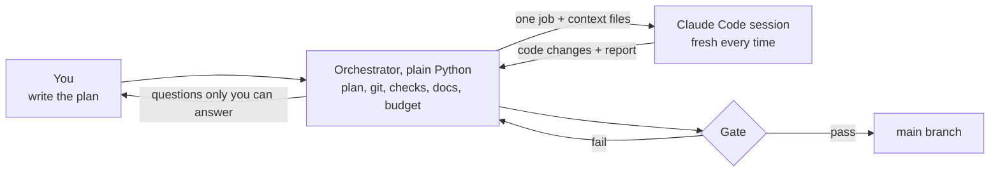
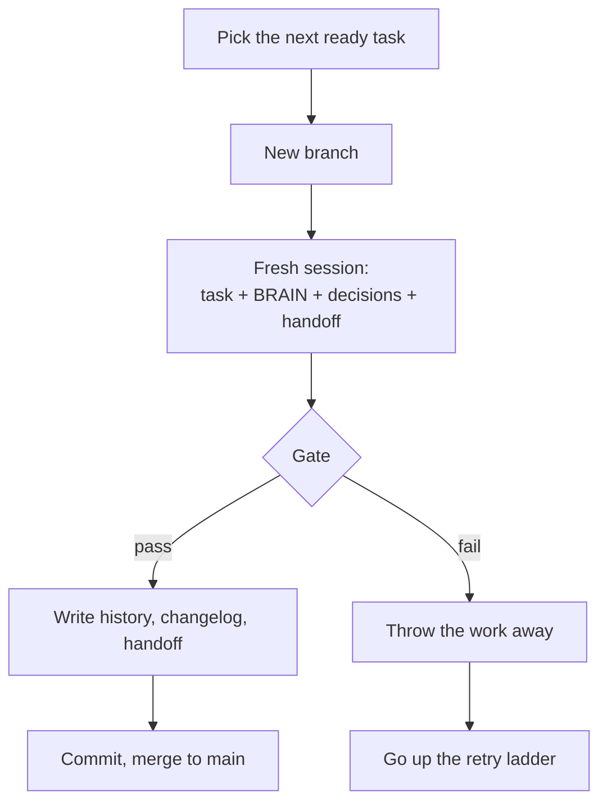
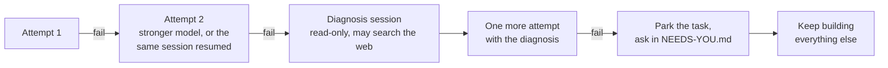
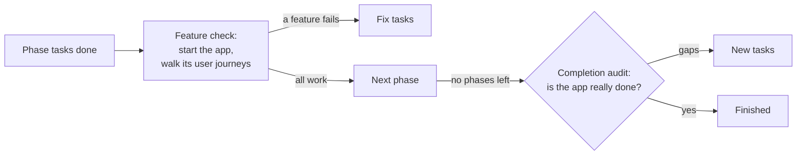
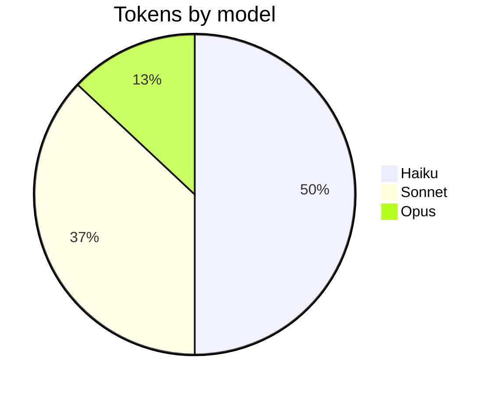

# Autopilot architecture

One idea: **the model writes code, plain Python decides what is kept.**

## 1. Who does what

| Actor | Owns |
|---|---|
| **Orchestrator** | Plan, progress, all git, running the checks, docs, deploys, model choice, budget |
| **Claude Code session** | One job: write the code for one task, or one review |
| **You** | The plan. Later: answers in `docs/NEEDS-YOU.md`, production approvals |

## 2. Life of one task

## 3. The gate

Run by the orchestrator after every task. The agent's own "done" is never trusted.

| Check | Catches | Result |
|---|---|---|
| Build, lint, typecheck, tests | Any command you configured is red | Fail |
| Test-tamper guard | A test deleted, skipped or emptied; weakened test settings; a changed CI file | Fail |
| Secret scan | An added line that looks like a key, token or password | Fail |
| Protected files | Edits to the plan, the config or the questions file | Fail |
| Empty diff | Nothing was changed | Fail |
| Scope | Changes outside the task's files | Warning |

## 4. When a task fails

The run never stops for one task.

## 5. When a phase or the plan finishes

## 6. Models: cheap first, strong when needed

| Task risk | Attempt 1 | Attempt 2 | Attempt 3 |
|---|---|---|---|
| Low | Haiku | Sonnet | Opus |
| Medium | Sonnet | Sonnet | Opus |
| High, critical | Opus | Opus | Opus |

A failed task moves up, never down. Real token share in the first project:

## 7. Self-healing

| Problem | What happens |
|---|---|
| Usage or rate limit | Sleeps until the window resets |
| Claude CLI, login or network down | Waits and reruns the same session |
| A tool is missing | Reruns setup, then one repair session |
| `main` goes red | A fixer session repairs it before more work |
| Push fails or `main` diverged | Keeps building locally, retries, tells you once |
| Plan or state file broken | Restores the last good copy |
| Autopilot crashes | Restarts from saved state |

Limits and outages never count as a failed attempt.

## 8. Memory lives in files

| File | Holds |
|---|---|
| `.agent/plan.yaml` | Phases and tasks |
| `.agent/BRAIN.md` | Architecture and rules. Every session reads it |
| `.agent/DECISIONS.md` | Decision log |
| `.agent/HANDOFF.md` | What the last session did |
| `.agent/history/` | A record per task |
| `.agent/state.db` | Progress, sessions, cost |
| `docs/NEEDS-YOU.md` | Questions for you |

No session depends on a long chat. After a crash or a reboot, the run continues from these files.

## 9. Trust boundary

- Sessions may not commit, push or switch branches. Git belongs to the orchestrator.
- Git hooks are off for every orchestrator git call, and `.git/config` is put back after each session.
- Sessions and checks get only an allowlist of environment variables, not your whole environment.
- Research sessions read the web but get no shell.
- Sessions run without permission prompts, so run the whole thing in a sandbox on a server. A Dockerfile and a
  systemd unit are in `deploy/`.

## 10. Code map

| File | Job |
|---|---|
| `cli.py` | All commands |
| `orchestrator.py` | The main loop |
| `plan.py` | Loads the plan, picks the next task |
| `gate.py` | The checks |
| `gitops.py` | All git commands |
| `context.py` | Builds each session's prompt from the files |
| `state.py` | SQLite state |
| `docs.py` | Writes history, changelog, handoff, RCA |
| `decisions.py` | `docs/NEEDS-YOU.md` |
| `report.py` | Status report and the live page |
| `notify.py` | Telegram, Slack, ntfy, webhook |
| `deploy.py` | Deploy, health check, rollback |
| `doctor.py` | Machine checks and safe fixes |
| `backends/` | Runs Claude Code, or another agent CLI |
| `prompts/` | Prompt text for each kind of session |

Details and every setting: [GUIDE.md](GUIDE.md).
