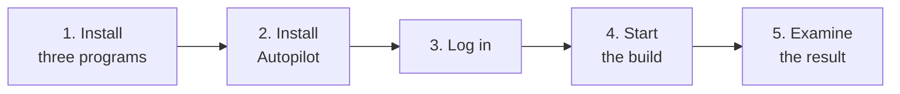

# Tutorial: build your first project

This tutorial takes you from an idea to a working app. Your part takes a few minutes. The run can take some hours,
and you do not have to watch it.

| Other pages | Use them to |
|---|---|
| [How-to guides](HOWTO.md) | Do one specific job: a server, phone alerts, a project that already exists |
| [Reference](REFERENCE.md) | Look up a command, a setting, a file, or a term |
| [Architecture](ARCHITECTURE.md) | Understand how Autopilot works and why |



## Before you start

You need a paid Claude plan (Pro or Max) or an API key. The free Claude plan cannot use Claude Code.

The first install takes approximately 4 minutes.

## Step 1: Install three programs

You install git, uv, and Claude Code. Python is not necessary: uv gets it for you.

- **Windows (PowerShell):**

  ```powershell
  winget install --id Git.Git -e
  powershell -ExecutionPolicy ByPass -c "irm https://astral.sh/uv/install.ps1 | iex"
  irm https://claude.ai/install.ps1 | iex
  ```

- **macOS, Linux, WSL:**

  ```bash
  curl -LsSf https://astral.sh/uv/install.sh | sh
  curl -fsSL https://claude.ai/install.sh | bash
  ```

> [!NOTE]
> If git is missing on macOS, run `xcode-select --install`. On Linux, run `sudo apt install git`. If `winget` is
> absent or asks for administrator rights, get git from <https://git-scm.com/download/win>.

Open a new terminal. The programs install into `~/.local/bin` (`%USERPROFILE%\.local\bin` on Windows), and the old
terminal does not find them.

## Step 2: Install Autopilot

```powershell
uv tool install git+https://github.com/manishjnv/AutoPilot
```

If the terminal does not find `autopilot`, run `uv tool update-shell`, and then open a new terminal.

## Step 3: Log in to Claude

```powershell
claude auth login
```

If you skip this step, `autopilot quickstart` and `autopilot run` stop before the first session. An API key
(`ANTHROPIC_API_KEY`) does not need a login.

## Step 4: Start the build

Give your idea to Autopilot:

```powershell
autopilot quickstart -C myapp --idea "a todo list CLI with due dates" --run
```

This one command:

1. Makes the folder `myapp`.
2. Writes `PLAN.md` from your idea, and makes the tasks.
3. Checks your computer.
4. Starts the build.

> [!TIP]
> To answer the same questions step by step, run `autopilot` with no arguments. If you have your own plan, see
> [Use a project that already exists](HOWTO.md#use-a-project-that-already-exists).

While the build runs:

- Your browser opens the live status page at `http://127.0.0.1:8765/`. To prevent this, add `--no-browser`.
- Each task shows a line, for example `▸ P01-T01 Project skeleton [haiku] · 1m12s`.
- The bottom row of the terminal shows the status line.
- Do not stop the run. Autopilot repairs failures and does not wait for you.

To follow the run from a different terminal, run `cd myapp`, and then use one of these commands:

| To see | Do this |
|---|---|
| Each step, live | `autopilot watch`. Ctrl+C stops the watch, not the run |
| A snapshot of the progress | `autopilot status` |
| All log lines | Open `.agent/logs/autopilot.log` |

If Autopilot has a question for you, it writes the question in `docs/NEEDS-YOU.md` and builds the other tasks. To
answer, run `autopilot answer`. See [Answer a question from Autopilot](HOWTO.md#answer-a-question-from-autopilot).

## Step 5: Examine the result

- At the end of the run, a message shows what Autopilot built, the blocked tasks, and the questions for you. It also
  shows an estimate of the work that remains.
- A `Not verified` line in the message shows the work that no check covered. Examine that work yourself.
- `autopilot stats` shows the number of tasks done, the cost, the time and what you had to do.
- The code is on the `main` branch. `CHANGELOG.md` lists the changes, and `docs/RCA.md` lists the bugs and their
  causes.

## Next steps

- To add features later, see [Add features after a run](HOWTO.md#add-features-after-a-run).
- To run Autopilot all night on a server, see [Run Autopilot on a server](HOWTO.md#run-autopilot-on-a-server).
- To learn what each command does, see [Commands](REFERENCE.md#commands).
- To get a newer version, run `uv tool install --reinstall git+https://github.com/manishjnv/AutoPilot`.
