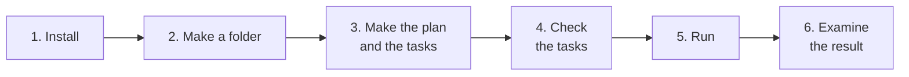

# Tutorial: build your first project

This tutorial takes you from an empty folder to a working app. Your part takes a few minutes. The run can take some
hours, and you do not have to watch it.

| Other pages | Use them to |
|---|---|
| [How-to guides](HOWTO.md) | Do one specific job: a server, phone alerts, a project that already exists |
| [Reference](REFERENCE.md) | Look up a command, a setting, a file, or a term |
| [Architecture](ARCHITECTURE.md) | Understand how Autopilot works and why |



## Before you start

| You need | Why |
|---|---|
| Python 3.10 or later | Autopilot is a Python program |
| git | Autopilot makes a commit for each task |
| Node.js | You install Claude Code with it |
| A Claude Pro or Max subscription, or an API key | Claude Code writes the code |

## Step 1: Install Autopilot

1. Install Claude Code:

   ```powershell
   npm i -g @anthropic-ai/claude-code
   ```

2. Start Claude Code with `claude`. Type `/login`, log in, and then type `/exit`.
3. Download and install Autopilot:

   ```powershell
   git clone https://github.com/manishjnv/AutoPilot
   python -m pip install -e ./AutoPilot
   ```

> [!TIP]
> If the terminal does not find `autopilot`, use `python -m autopilot`. The first `autopilot quickstart` adds
> Autopilot to your PATH for new terminals.

## Step 2: Make a project folder

Make an empty folder with a git repository:

```powershell
mkdir myapp; cd myapp; git init -b main
```

## Step 3: Make the plan and the tasks

Do one of these two procedures.

**If you have only an idea:** give the idea to Autopilot. Claude writes `PLAN.md` for you, and then makes the tasks.

```powershell
autopilot quickstart --idea "a CLI that finds leaked secrets in a repo"
```

**If you have your own plan:** save it as `PLAN.md` in the folder, and then make the tasks. Clear acceptance
criteria give better results.

```powershell
autopilot quickstart
```

In both procedures, `quickstart` makes the `.agent/` folder, writes the task list, and checks your computer.

## Step 4: Check the tasks

1. Show the tasks in order, with the AI model for each task:

   ```powershell
   autopilot next
   ```

2. Read `.agent/plan.yaml` and `.agent/BRAIN.md`.
3. Correct the errors that you find. A change costs the least at this step.

## Step 5: Start a short run

Start a run that stops after 10 sessions:

```powershell
autopilot run --max-sessions 10
```

- Your browser opens the live status page at `http://127.0.0.1:8765/`. To prevent this, add `--no-browser`.
- Each task shows a line, for example `▸ P01-T01 Project skeleton [haiku] · 1m12s`.
- The bottom row of the terminal shows the status line.
- Do not stop the run. Autopilot repairs failures and does not wait for you.

To follow the run from a different terminal:

| To see | Do this |
|---|---|
| Each step, live | `autopilot watch`. Ctrl+C stops the watch, not the run |
| A snapshot of the progress | `autopilot status` |
| All log lines | Open `.agent/logs/autopilot.log` |

If Autopilot has a question for you, it writes the question in `docs/NEEDS-YOU.md` and builds the other tasks. To
answer, see [Answer a question from Autopilot](HOWTO.md#answer-a-question-from-autopilot).

## Step 6: Examine the result

- At the end of the run, a message shows what Autopilot built, the blocked tasks, and the questions for you. It also
  shows an estimate of the work that remains.
- `autopilot stats` shows the number of tasks done, the cost, the time and what you had to do.
- The code is on the `main` branch. `CHANGELOG.md` lists the changes, and `docs/RCA.md` lists the bugs and their
  causes.

When the short run looks correct, start the full run:

```powershell
autopilot run
```

## Next steps

- To add features later, see [Add features after a run](HOWTO.md#add-features-after-a-run).
- To run Autopilot all night on a server, see [Run Autopilot on a server](HOWTO.md#run-autopilot-on-a-server).
- To learn what each command does, see [Commands](REFERENCE.md#commands).
