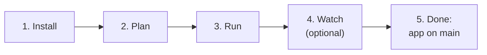
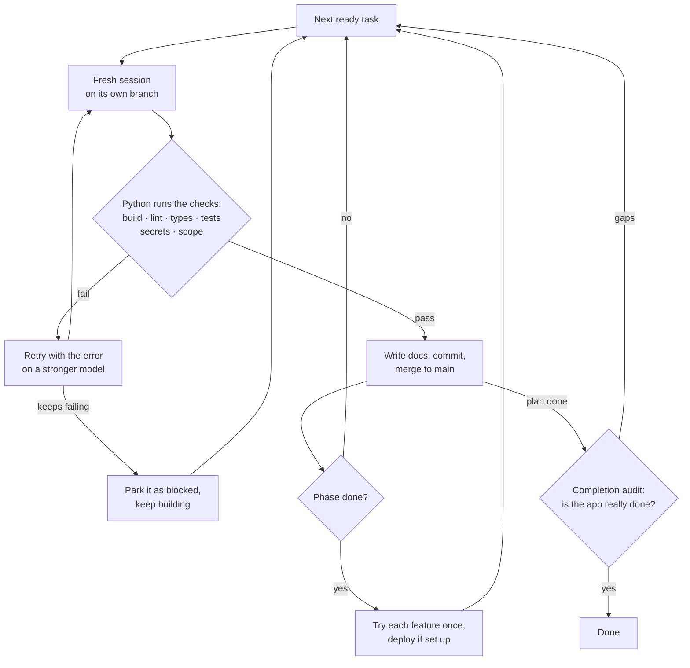
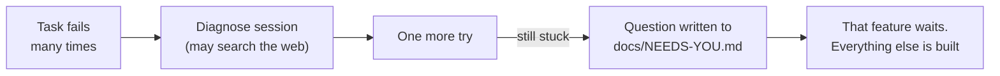

# Autopilot guide

Everything in simple steps. Short version: [README](README.md). Diagrams: [ARCHITECTURE.md](ARCHITECTURE.md).

**Jump to:** [Install](#1-install-once) · [Plan](#2-plan-your-project) · [Run](#3-run-it) · [While it runs](#4-while-it-runs) · [When done](#5-when-it-is-done) · [How it works](#how-it-works) · [Commands](#commands) · [Stuck tasks](#when-a-task-gets-stuck) · [Self-healing](#self-healing) · [Usage and cost](#usage-and-cost) · [GitHub bugs](#bugs-from-github) · [Server](#run-it-on-a-server-vps) · [Plan tips](#tips-for-a-good-plan)



---

## 1. Install (once)

| You need | Why |
|---|---|
| Python 3.10+ | Runs Autopilot |
| git | Every task is a commit |
| Node.js | Installs Claude Code |
| Claude Pro/Max (or an API key) | Does the coding |

```powershell
npm i -g @anthropic-ai/claude-code       # Claude Code
claude                                   # type /login once, then /exit
git clone https://github.com/manishjnv/AutoPilot
python -m pip install -e ./AutoPilot     # adds the `autopilot` command
```

> **"autopilot is not recognized"?** Use `python -m autopilot` instead. The first `quickstart` fixes PATH for new terminals.

---

## 2. Plan your project

**Step 1.** Make an empty git folder:
```powershell
mkdir myapp; cd myapp; git init -b main
```

**Step 2.** Pick one:

| You have | Do this |
|---|---|
| Just an idea | `autopilot quickstart --idea "a CLI that finds leaked secrets"`. It writes `PLAN.md` for you |
| Your own plan | Save it as `PLAN.md` (or pass `--plan-doc <file>`). Clear acceptance criteria = better results |

**Step 3.** Turn the plan into tasks:
```powershell
autopilot quickstart     # sets up .agent/ and writes the task list
autopilot next           # shows the tasks in order, with the model for each
```

**Step 4.** Read `.agent/plan.yaml` and `.agent/BRAIN.md`. Fix anything wrong **now**. This is the cheapest moment.

> **Existing project?** Same steps, inside its folder: `autopilot quickstart --plan-doc <your roadmap>`. No plan? It reads the repo and proposes one.

---

## 3. Run it

```powershell
autopilot run --max-sessions 10    # first time: a short test run
autopilot run                      # after that: the full run
```

- Each task prints a line like `▸ P01-T01 Project skeleton [haiku] · 1m12s`.
- Leave it alone. It fixes failures itself and **never waits for you**.

**Follow it from anywhere:**

| Where | How |
|---|---|
| Browser | Opens by itself at http://127.0.0.1:8765/ (`--no-browser` to skip) |
| Another terminal | `autopilot watch` (Ctrl+C stops watching, not the run) |
| Log file | `.agent/logs/autopilot.log` |

---

## 4. While it runs

| You want to… | Do this |
|---|---|
| See progress | `autopilot watch`, the browser page, or `autopilot status` |
| See it at a glance | The status line: bottom row of `run` and `watch`, the window title, the top of the page. `AUTOPILOT_PLAIN=1` turns the pinned row off |
| Answer a question | Read `docs/NEEDS-YOU.md`, then `autopilot answer D-001 "your answer"` |
| Pause | `autopilot stop`. Continue later with `autopilot run` |
| Get phone alerts | Set `AUTOPILOT_TG_TOKEN` + `AUTOPILOT_TG_CHAT` (Telegram) or `AUTOPILOT_NTFY_TOPIC` |

---

## 5. When it is done

- The end-of-run message says what was built, what is stuck, what needs you and about how much is left.
- `autopilot stats` shows the result: tasks done, cost, time, what you had to do.
- The code is on `main`, with `CHANGELOG.md` and `docs/RCA.md`.
- **Want more features?** Add lines like `- dark mode` to `docs/BACKLOG.md`, then `autopilot run` again.

> **Share it:** send the repo link (MIT license). Each person installs it and uses **their own** Claude login. A cloned project keeps its plan and history in `.agent/`.

---

## How it works



| Common problem | What Autopilot does |
|---|---|
| Agent forgets things after many hours | One fresh session per task. Memory lives in files |
| Agent says "done" when it isn't | Python runs the checks itself |
| One failing task blocks everything | Retry, stronger model, then park it. The rest keeps going |
| `main` breaks | A fix session repairs it first |
| Risky design choices | High-risk tasks first compare 2-3 options and record the choice in `docs/adr/` |
| Missing pieces at the end | The completion audit adds new tasks |
| A deploy fails | Health check, automatic rollback, plus a fix task |
| Crash or reboot | Picks up where it stopped |

**Files it keeps in `.agent/`:**

| File | What it holds |
|---|---|
| `project.yaml` | Settings: commands, models, budgets |
| `plan.yaml` | Phases and tasks |
| `BRAIN.md` | Architecture and rules. Every session reads it |
| `DECISIONS.md` | Log of decisions |
| `HANDOFF.md` | What the last session did, what's next |
| `history/` | One file per finished task |
| `state.db`, `REPORT.md` | Progress and live status (not in git) |

**Works with:** python, node, go, rust, java, docker, static, or anything with build/test commands in `commands:`.

**Model per task risk** (attempt 1 → 2 → 3):

| Risk | Models |
|---|---|
| low | haiku → sonnet → opus |
| medium | sonnet → sonnet → opus |
| high / critical | opus |

- Mark auth, payments, crypto and migrations as `high` or `critical`.
- Other agent CLIs: set `agent.preset: codex | gemini | opencode` (less tested than Claude Code).

---

## Commands

Every command takes `-C <project folder>`.

| Command | What it does |
|---|---|
| `autopilot quickstart` | Set up, write the plan, check the machine |
| `autopilot next` | Show the task order and models |
| `autopilot run` | Build until the app is done |
| `autopilot watch` | Follow a run live |
| `autopilot status` | Snapshot: progress, cost, blocked tasks |
| `autopilot stats` | Final numbers of a run |
| `autopilot answer D-003 "text"` | Answer a question from `docs/NEEDS-YOU.md` |
| `autopilot stop` / `resume` | Stop before the next session / continue |
| `autopilot unblock T1` / `skip T1` | Retry or drop a blocked task |
| `autopilot approve P05` | Send a waiting phase to production |
| `autopilot doctor --fix` | Check and repair the machine setup |
| `autopilot validate` | Check `plan.yaml` for mistakes |
| `autopilot serve` | Status page without a run |
| `autopilot review --kind completion` | Force an audit now |
| `autopilot init` / `onboard` | Manual setup (quickstart does both) |

---

## When a task gets stuck



- Only real owner decisions reach you: logins, paid accounts, business or legal calls.
- Answer with `autopilot answer`, or type it after "Your answer:" in the file.
- A red check on `main` never stops the run. It becomes a fix task first.

---

## Self-healing

A run stops only for something that truly needs you. Every fix shows up as a `heal` notice.

| Problem | Autopilot's fix |
|---|---|
| Code fails its checks | Stronger model → diagnose → ask you, keep building |
| A tool is missing | Re-runs setup; if still broken, a repair session fixes it |
| Claude CLI broken, logged out, or offline | Reinstalls or waits, then retries (not counted as a failure) |
| Usage limit hit | Sleeps until the window resets |
| `autopilot` not on PATH | Adds a launcher and fixes PATH |
| Push to GitHub fails | Keeps building locally, retries on each commit |
| `main` differs from GitHub | Replays local commits on top |
| Stale git lock file | Removes it and retries |
| `plan.yaml` broken | Restores the last good version |
| `state.db` damaged | Restores the backup from run start |
| Autopilot crashes | Saves a crash report, restarts from saved state |

**Still needs you:**
- Your Claude login (`claude`, then `/login`).
- Budgets and limits you set.
- Questions in `docs/NEEDS-YOU.md`.
- A crash that keeps repeating (send the report in `.agent/logs/crashes/`).

---

## Usage and cost

- **Tokens and cost** per model are in `autopilot status` and `.agent/REPORT.md`.
- **5-hour window:** reads your real usage from Claude Code, your own use included, and pauses when only 15% is left
  (`usage.reserve_pct`), so you can still use Claude yourself. One notice when the weekly limit passes 90%.
- **Usage limit hit:** sleeps until reset and tells you. Not counted as a failure.
- **Budget caps:** per session, task, phase, day and total. On an API key, set `usage.billing: api`.
- **Bug fixes** add a test and a root cause to `docs/RCA.md`.
- **Model tips:** every 20 tasks it suggests a cheaper model where it is safe. You decide.

---

## Bugs from GitHub

Turn on with `intake.enabled: true` (needs `gh` logged in).

| Source | What happens |
|---|---|
| Issue with the `autopilot` label | Rewritten as a fix task, fixed, then closed with a comment |
| Failed CI run on `main` | Becomes one fix task with the log |
| Feature request | Goes to `docs/BACKLOG.md` instead |

- Only people with triage access can add labels, so the label is the safety check.
- The coding session never sees the raw issue text.

---

## Run it on a server (VPS)

**One command** (from an Autopilot checkout):
```bash
sudo deploy/install.sh <name> <git-url>
```

**Then:**
1. **Log in** with your Claude subscription, or set `ANTHROPIC_API_KEY` and `usage.billing: api`.
2. **Start:** `sudo systemctl enable --now autopilot@<name>`
3. **Logs:** `journalctl -u autopilot@<name> -f`
4. **Alerts:** Telegram, Slack, ntfy or a webhook. With `chat.enabled: true` you can reply to the Telegram bot: `status`, `answer D-003 use Stripe`, `approve P05`.
5. **Status page:** `ssh -L 8765:127.0.0.1:8765 your-vps`, then open http://127.0.0.1:8765/.

**Safety:**
- Runs in Docker, each project in its own folder (`/srv/autopilot/<name>`).
- Secrets in `/etc/autopilot/<name>.env` (mode 600). Keep prod secrets away from the agent.
- Optional network allowlist: `sandbox.enabled: true` + `sandbox.allowed_domains: [pypi.org, github.com]`.
- Opening the status page beyond localhost needs `AUTOPILOT_STATUS_TOKEN`.

---

## Tips for a good plan

- **One task = one session**: about 1-3 files of real logic.
- **2-5 testable acceptance criteria** per task.
- **Put the hard rules in `BRAIN.md`**: auth, data isolation, API contracts.
- **Slow end-to-end tests** go in `commands.phase_verify`, not in every task.
- **A blocked task means an unclear spec.** Fix the spec, then `autopilot unblock`.

---

## Development

```bash
pip install -e '.[dev]' && pytest -q     # uses a fake agent, no API calls
```

Runs on Linux, macOS and Windows. CI tests Ubuntu and Windows.
