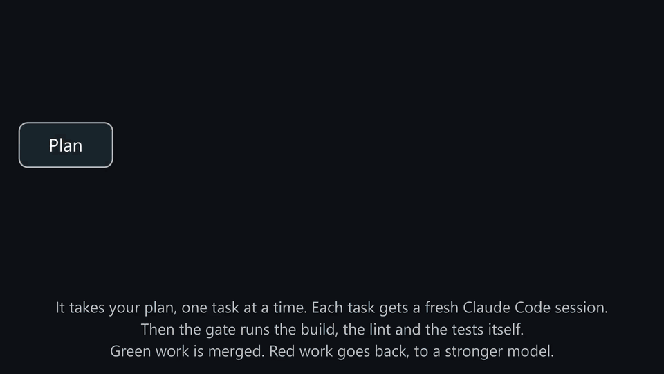
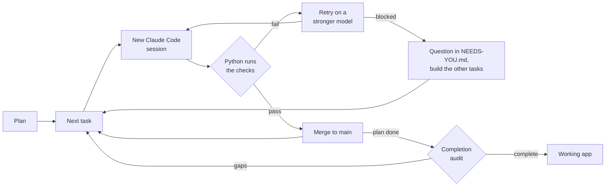

# Autopilot

**Give it a plan tonight. Wake up to a working app, and proof that it works.**

Autopilot runs Claude Code through your full plan, and you do not have to watch it. Python code, not the AI model,
decides when a task is complete.

[](https://github.com/manishjnv/AutoPilot/actions/workflows/ci.yml)

[](LICENSE)

## Why use it

| A coding agent alone | With Autopilot |
|---|---|
| Says "tests pass" | **Runs the checks itself.** It merges only code that passes |
| Skips or deletes a test that fails | **The test-tamper guard** fails the task |
| Makes more errors after many hours | **Starts a new session for each task** |
| Stops and waits for your answer | **Does not wait.** It records the question and builds the other tasks |
| Stops after a crash or a usage limit | **Repairs the problem** and continues |
| Says that the plan is complete | **Tries each feature, then audits the full app** |

## How it works





## Real results

Two real projects, each a CLI built from a plan:

- **SecretScan** finds leaked secrets in a repository.
- **envguard** checks `.env` files against a schema and finds secrets in the git history.

| Measure | SecretScan | envguard |
|---|---|---|
| Tasks merged | **27 of 27**: 13 from the plan, 14 from the audits | **21 of 21**: 11 from the plan, 10 from the audits |
| Blocked tasks | **0** | **0** |
| Passed on the first attempt | 25 of 27 | 17 of 21 |
| Decisions that needed a person | **0** | **0** |
| Agent time | 2.2 hours, 38 sessions | 1.4 hours, 42 sessions |
| Cost at API prices | $17.13 | $19.01 |

Both runs used a subscription. The envguard audits found 8 real bugs, and Autopilot fixed all of them.

## Quick start

You need a paid Claude plan or an API key. The free Claude plan cannot use Claude Code. The first install takes
approximately 4 minutes.

```powershell
winget install --id Git.Git -e
powershell -ExecutionPolicy ByPass -c "irm https://astral.sh/uv/install.ps1 | iex"
irm https://claude.ai/install.ps1 | iex
# Open a new terminal. Then:
uv tool install git+https://github.com/manishjnv/AutoPilot
claude auth login
autopilot quickstart -C myapp --idea "a todo list CLI with due dates" --run
```

These commands are for Windows PowerShell. For macOS and Linux, and for each step in detail, see the
[tutorial](GUIDE.md). If you already have a plan, see
[Use a project that already exists](HOWTO.md#use-a-project-that-already-exists). To start from a Claude Code chat,
paste one prompt or install the plugin: see [Start from inside Claude Code](HOWTO.md#start-from-inside-claude-code).

**After the run:** the code is on `main`. Also read `CHANGELOG.md`, `docs/RCA.md` and `docs/NEEDS-YOU.md`.

## Example output

This is real output, shortened. The checks reject a skipped test, the next attempt passes, and the audit finds gaps:

```text
task P02-T01 attempt 1 failed: PROBLEM: skip/focus marker added in tests/test_walker.py
session #10 task P02-T01 model=sonnet attempt=2
task P02-T01 done (sonnet, $0.39)
audit: completion audit: 92% complete, 8 corrective tasks (FIX001)
```

## Documentation

| To | Read |
|---|---|
| Build your first project, step by step | [Tutorial](GUIDE.md) |
| Do one specific job: a server, phone alerts, a project that already exists | [How-to guides](HOWTO.md) |
| Look up a command, a setting, a file, or a term | [Reference](REFERENCE.md) |
| Understand how Autopilot works and why | [Architecture](ARCHITECTURE.md) |

## Good to know

> [!WARNING]
> Use a sandbox on a server. Claude Code sessions run without permission prompts. See
> [Run Autopilot on a server](HOWTO.md#run-autopilot-on-a-server).

- Autopilot is for a solo developer. This is version 0.1.0, an early release.
- Codex, Gemini, and OpenCode work through presets. They have less testing than Claude Code.
- Autopilot has the [MIT license](LICENSE).
