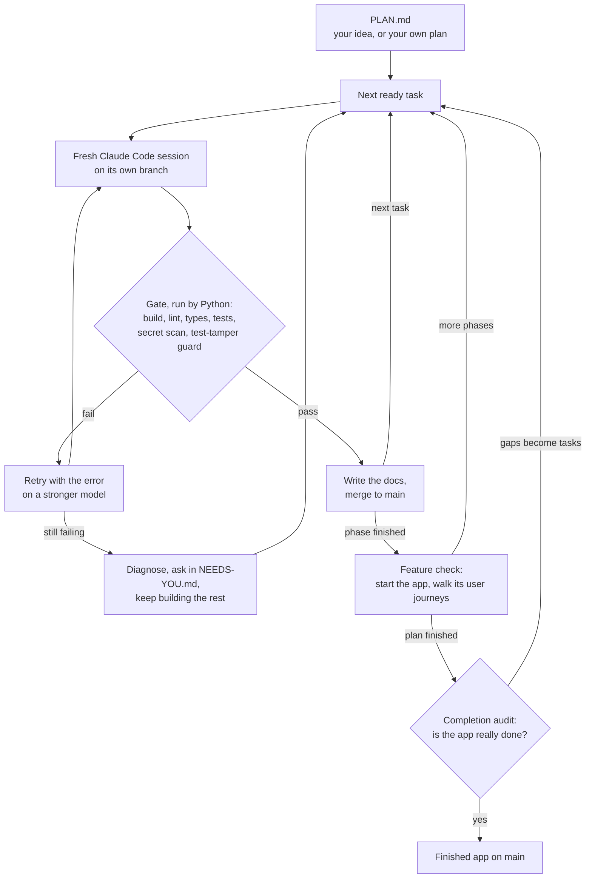

# Autopilot

**Give it a plan tonight. Wake up to a working app, and proof that it works.**

Autopilot drives Claude Code through your whole project plan, one task per fresh session, with nobody watching.
A plain Python orchestrator, not the model, decides what counts as done. It runs your build, lint, typecheck and
tests itself, and only green work reaches `main`.

[](https://github.com/manishjnv/AutoPilot/actions/workflows/ci.yml)

[](LICENSE)

## The problem

Coding agents say "done" when the work isn't.

- They report passing tests they never ran.
- They skip or weaken a failing test until it passes.
- They lose the thread after a few hours, or stop at 2 a.m. to ask a question nobody will answer.
- "Finished" means the plan ran out, not that the app works.

## What Autopilot does about it

| A coding agent on its own | With Autopilot |
|---|---|
| Says the tests pass | **Runs the checks itself** after every task. Only a green result is merged |
| Deletes or skips a failing test | **Test-tamper guard.** Deleted, skipped or weakened tests fail the task. So do secrets and empty diffs |
| Drifts after hours of context | **One fresh session per task.** Memory lives in files, not in a chat |
| Stops to ask a question | **Never waits.** It retries on a stronger model, diagnoses, then writes the question to `docs/NEEDS-YOU.md` and builds everything else |
| A crash or a usage limit ends the night | **Heals itself.** Crashes, usage limits, a broken environment and git trouble are repaired or waited out |
| Calls the plan "finished" | **Tries the features** at the end of each phase, then **audits completion**. Gaps become new tasks |

## Real results

The first real project: **SecretScan**, a command-line tool that finds leaked secrets in a repository. The plan
had 13 tasks. Two completion audits then found 14 more problems on their own, for example a baseline that would
have hidden newly added private keys. Autopilot fixed those too.

| Measure | Result |
|---|---|
| Tasks merged to `main` | **27 of 27** (13 planned, 14 found by the audits) |
| Tasks stuck | **0** |
| Passed every check on the first try | 25 of 27 (93%) |
| Decisions the owner had to make | **0** |
| Agent time | 2.2 hours over 38 sessions |
| Cost | $17.13 at API prices. It ran on a Claude subscription |
| Tests in the finished project | 149 |

The checks earned their keep on the way: an agent marked a test to be skipped, the gate refused the task, and
the retry passed without the skip. Numbers come from `autopilot stats`.

## Quick start

You need Python 3.10+, git, Node.js and a Claude Pro or Max subscription (or an API key).

```powershell
npm i -g @anthropic-ai/claude-code      # the agent Autopilot drives. Run `claude` once and /login
git clone https://github.com/manishjnv/AutoPilot
python -m pip install -e ./AutoPilot    # installs the `autopilot` command

mkdir myapp; cd myapp; git init -b main
autopilot quickstart --idea "a CLI that finds leaked secrets in a repo"
autopilot run --max-sessions 10         # a short first run. Later, just `autopilot run`
```

`quickstart` writes the plan, turns it into tasks and checks your machine. Read `.agent/plan.yaml` before you
run: it is the cheapest moment to change anything. Already have a plan? Use
`autopilot quickstart --plan-doc PLAN.md`. It also works on an existing project.

## What a run looks like

Real output from the project above, trimmed:

```text
run_start: 0/13 tasks done (0%), 0 blocked, 13 pending across 4 phases
session #3 task P01-T01 model=haiku attempt=1
  ▸ P01-T01 Project skeleton and tooling [haiku] · Write src/secretscan/__init__.py · 2m01s
task P01-T01 done (haiku, $0.45)
...
session #9 task P02-T01 model=sonnet attempt=1
task P02-T01 attempt 1 failed: PROBLEM: skip/focus marker added in tests/test_walker.py: pytest.skip("symlinks unsupported")
session #10 task P02-T01 model=sonnet attempt=2
task P02-T01 done (sonnet, $0.39)
phase_done: P02 Scanning a folder: done. 7/13 tasks done (53%), 0 blocked, 6 pending across 4 phases.
...
audit: completion audit: 92% complete, 8 corrective tasks (FIX001)
```

**While it runs.** A live page opens in your browser at `http://127.0.0.1:8765/`. `autopilot watch` follows the
run from any terminal. Set `AUTOPILOT_TG_TOKEN` and `AUTOPILOT_TG_CHAT` (Telegram) or `AUTOPILOT_NTFY_TOPIC` to
get pinged on your phone. With Telegram and `chat.enabled: true` you can answer its questions from there too.

**In the morning.** The code is on `main`, with a `CHANGELOG.md`, a root-cause log in `docs/RCA.md`, a record of
every task in `.agent/history/`, and a short list of decisions only you can make in `docs/NEEDS-YOU.md`.
`autopilot stats` prints the numbers.

## How it works



- **Cheap first, strong when needed.** Low-risk tasks start on Haiku, medium on Sonnet, high-risk on Opus. A
  failed task moves up, never down.
- **Memory in files.** Every session reads `BRAIN.md` (architecture and rules), the decision log and the last
  handoff. Nothing depends on a long chat.
- **Limits you set.** Cost caps per session, task, phase and day. On a subscription it sleeps through usage
  limits and can keep a share of the 5-hour window free for you.
- **State that survives.** Progress lives in SQLite and git. After a crash or a reboot it continues where it
  stopped.

## Everyday commands

| Command | What it does |
|---|---|
| `autopilot quickstart` | Set up the project, write the plan, check the machine |
| `autopilot run` | Build until the completion audit passes |
| `autopilot watch` | Follow a run live from any terminal |
| `autopilot status` | Progress, cost, blocked tasks, open decisions |
| `autopilot answer D-001 "use Stripe"` | Answer a question from `docs/NEEDS-YOU.md` |
| `autopilot stop` | Stop before the next session. `autopilot run` continues |
| `autopilot stats` | Tasks done, first-try rate, cost, time |
| `autopilot doctor --fix` | Check the machine and repair what needs no person |

## Good to know

- **Made for a solo developer** with a plan and a Claude subscription, on a PC or on your own server.
- **Sessions run without permission prompts** (`bypassPermissions`). Use a folder and a machine you are happy to
  let an agent work in. For a server, the guide has a sandboxed Docker setup and a network allowlist.
- **Early software.** Version 0.1.0, one real project so far. The test suite runs the whole loop end to end with
  a scripted fake agent, on Ubuntu and Windows.
- **Other agent CLIs** (Codex, Gemini, OpenCode) work through presets. They are tested less than Claude Code.
- Formerly AutoDev. Existing projects keep working.

## Documentation

The **[guide](GUIDE.md)** has everything else: the full command list, the self-healing table, usage pacing,
bug intake from GitHub issues, running on a VPS, and how to write plans that run well unattended.

## License

[MIT](LICENSE). Free to use, change and share.
