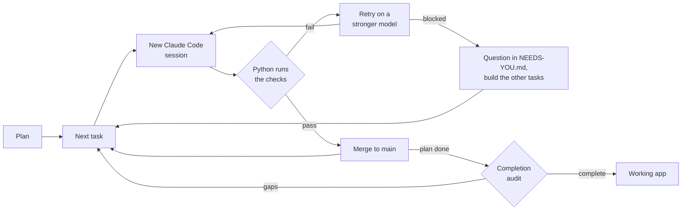

# Autopilot

**Give it a plan tonight. Wake up to a working app, and proof that it works.**

Autopilot runs Claude Code through your full plan, and you do not have to watch it. Python code, not the AI model,
decides when a task is complete.

[](https://github.com/manishjnv/AutoPilot/actions/workflows/ci.yml)

[](LICENSE)

## Why use it

| A coding agent alone | With Autopilot |
|---|---|
| Says "tests pass" | **Runs the checks itself.** It merges only code that passes |
| Skips or deletes a test that fails | **The test-tamper guard** fails the task |
| Makes more errors after many hours | **Starts a new session for each task** |
| Stops and waits for your answer | **Does not wait.** It records the question and builds the other tasks |
| Stops after a crash or a usage limit | **Repairs the problem** and continues |
| Says that the plan is complete | **Tries each feature, then audits the full app** |

## How it works



## Real results

The first real project was **SecretScan**, a CLI that finds leaked secrets in a repository.

| Measure | Result |
|---|---|
| Tasks merged | **27 of 27**: 13 from the plan and 14 from the audits |
| Blocked tasks | **0** |
| Passed on the first attempt | 25 of 27 |
| Decisions that needed a person | **0** |
| Agent time | 2.2 hours, 38 sessions |
| Cost | $17.13 at API prices. The run used a subscription |

## Quick start

You need Python 3.10 or later, git, Node.js, and a Claude subscription or an API key.

```powershell
npm i -g @anthropic-ai/claude-code      # then run `claude` once and type /login
git clone https://github.com/manishjnv/AutoPilot
python -m pip install -e ./AutoPilot

mkdir myapp; cd myapp; git init -b main
autopilot quickstart --idea "a CLI that finds leaked secrets in a repo"
autopilot run
```

If you already have a plan, use `autopilot quickstart --plan-doc PLAN.md`.

**After the run:** the code is on `main`. Also read `CHANGELOG.md`, `docs/RCA.md` and `docs/NEEDS-YOU.md`.

## Example output

This is real output, shortened. The checks reject a skipped test, the next attempt passes, and the audit finds gaps:

```text
task P02-T01 attempt 1 failed: PROBLEM: skip/focus marker added in tests/test_walker.py
session #10 task P02-T01 model=sonnet attempt=2
task P02-T01 done (sonnet, $0.39)
audit: completion audit: 92% complete, 8 corrective tasks (FIX001)
```

## Documentation

| To | Read |
|---|---|
| Build your first project, step by step | [Tutorial](GUIDE.md) |
| Do one specific job: a server, phone alerts, a project that already exists | [How-to guides](HOWTO.md) |
| Look up a command, a setting, a file, or a term | [Reference](REFERENCE.md) |
| Understand how Autopilot works and why | [Architecture](ARCHITECTURE.md) |

## Good to know

> [!WARNING]
> Use a sandbox on a server. Claude Code sessions run without permission prompts. See
> [Run Autopilot on a server](HOWTO.md#run-autopilot-on-a-server).

- Autopilot is for a solo developer. This is version 0.1.0, an early release.
- Codex, Gemini, and OpenCode work through presets. They have less testing than Claude Code.
- Autopilot has the [MIT license](LICENSE).
