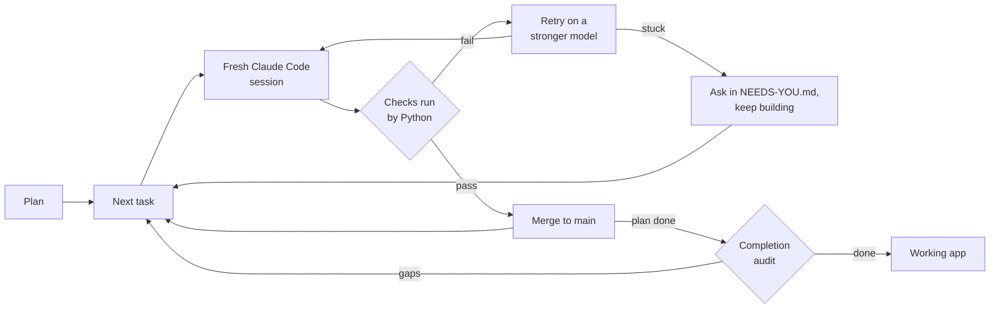

# Autopilot

**Give it a plan tonight. Wake up to a working app, and proof that it works.**

Runs Claude Code through your whole plan, unattended. Plain Python, not the model, decides what is done.

[](https://github.com/manishjnv/AutoPilot/actions/workflows/ci.yml)

[](LICENSE)

## Why

| A coding agent alone | With Autopilot |
|---|---|
| Says "tests pass" | **Runs the checks itself.** Only green is merged |
| Skips or deletes a failing test | **Test-tamper guard** fails the task |
| Drifts after hours | **One fresh session per task** |
| Stops to ask you | **Never waits.** Parks the question, builds the rest |
| Dies on a crash or a usage limit | **Heals itself** and resumes |
| Calls the plan "finished" | **Tries the features, then audits completion** |

## How it works



More diagrams: [ARCHITECTURE.md](ARCHITECTURE.md).

## Real results

First real project: **SecretScan**, a CLI that finds leaked secrets in a repo.

| Measure | Result |
|---|---|
| Tasks merged | **27 of 27** (13 planned + 14 found by the audits) |
| Tasks stuck | **0** |
| Passed first try | 25 of 27 |
| Decisions needed from the owner | **0** |
| Agent time | 2.2 hours, 38 sessions |
| Cost | $17.13 at API prices (ran on a subscription) |

## Quick start

Needs Python 3.10+, git, Node.js, and a Claude subscription or API key.

```powershell
npm i -g @anthropic-ai/claude-code      # then run `claude` once and /login
git clone https://github.com/manishjnv/AutoPilot
python -m pip install -e ./AutoPilot

mkdir myapp; cd myapp; git init -b main
autopilot quickstart --idea "a CLI that finds leaked secrets in a repo"
autopilot run
```

Already have a plan? `autopilot quickstart --plan-doc PLAN.md`

## Example

Real output, trimmed. The gate refuses a skipped test, the retry passes, and the audit finds gaps:

```text
task P02-T01 attempt 1 failed: PROBLEM: skip/focus marker added in tests/test_walker.py
session #10 task P02-T01 model=sonnet attempt=2
task P02-T01 done (sonnet, $0.39)
audit: completion audit: 92% complete, 8 corrective tasks (FIX001)
```

## Use it

| You want to | Do this |
|---|---|
| Watch live | `autopilot watch`, or the page at `http://127.0.0.1:8765/` |
| See progress and cost | `autopilot status` |
| Answer a question | `autopilot answer D-001 "use Stripe"` |
| Stop, then continue | `autopilot stop`, then `autopilot run` |
| Get phone pings | Set `AUTOPILOT_TG_TOKEN` + `AUTOPILOT_TG_CHAT`, or `AUTOPILOT_NTFY_TOPIC` |
| See the numbers | `autopilot stats` |

**In the morning:** code on `main` · `CHANGELOG.md` · `docs/RCA.md` · `docs/NEEDS-YOU.md`

## Good to know

- For a solo developer. Version 0.1.0, early.
- Sessions run without permission prompts. On a server, use the sandbox in the [guide](GUIDE.md#running-unattended-on-a-vps).
- Codex, Gemini and OpenCode work through presets, less tested.

**More:** [Architecture](ARCHITECTURE.md) · [Guide](GUIDE.md) · [MIT license](LICENSE)
