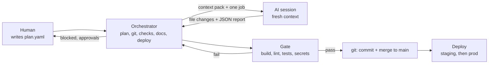
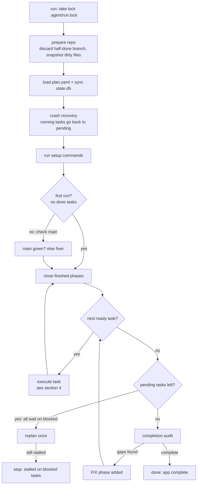
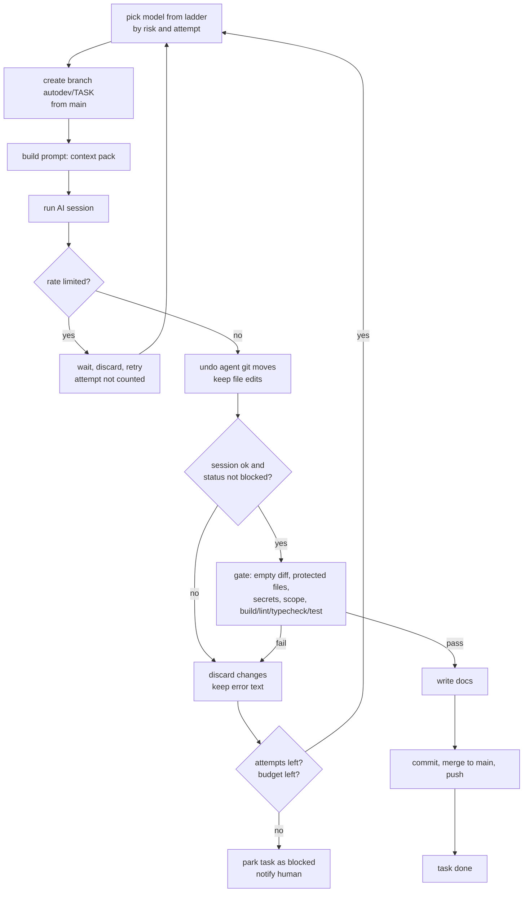

# Autopilot architecture

Autopilot was called AutoDev. Until the rename lands (roadmap step R), the code folder is `autodev/` and the command is `autodev`.

## 1. What it is

- A small Python command-line tool (about 2,000 lines).
- It runs Claude Code in headless mode (`claude -p`) again and again, one job per session.
- Its goal: take a phased plan and build a whole app, from first task to deploy.
- A plain Python "boss" (the orchestrator) controls everything. The AI only writes code and reviews.

## 2. Big picture: who does what

There are three actors. Each has a clear job.

- **The orchestrator (Python, deterministic).** Same input gives same behaviour. It owns:
  - the plan and the progress state
  - all git actions
  - running the checks (build, lint, tests)
  - writing the docs
  - deploying and rolling back
  - choosing the model and the budget
- **AI sessions (Claude Code).** Each session does one job with fresh context: one task, a fix, an audit or a replan.
  - Sessions are told not to commit, push or switch branches. Git is the orchestrator's job.
- **The human.** Writes the plan, then only:
  - answers blocked tasks (`unblock` or `skip`)
  - approves production deploys (`approve`)

How to read it:

1. The human gives the plan. The orchestrator reads it.
2. The orchestrator builds a small "context pack" and starts a fresh AI session.
3. The session edits files and ends with a JSON report.
4. The orchestrator, not the AI, runs the gate. Pass means commit and merge. Fail means retry.
5. At the end of a phase, the orchestrator deploys.
6. When a task is stuck or a deploy needs approval, the orchestrator tells the human.

## 3. Main loop flow

Entry point: `Orchestrator.run()` calls `_run()`, which calls `loop()`. See [orchestrator.py](../autodev/orchestrator.py).

Steps:

1. **Lock.** `run()` takes `.agent/run.lock`. A second run on the same project exits.
2. **Prepare repo.** `_prepare_repo()` makes sure git exists and checks out `main`.
   - If it finds an `autodev/...` branch, a crash left it. The work is thrown away.
   - Uncommitted files are saved as one snapshot commit.
3. **Load the plan.** `reload_plan()` reads [plan.yaml](../autodev/plan.py) and syncs it into the database.
   - New tasks are added. Tasks removed from the plan are marked `skipped`.
   - Tasks flagged `reopen: true` go back to `pending`.
   - A bad plan ends the run with `fatal: invalid plan`.
4. **Crash recovery.** Tasks left as `running` are reset to `pending`.
5. **Setup commands.** `commands.setup` runs once. A failure only logs a warning.
6. **Main-green check.** On a project that already has done tasks, the checks run on `main`.
   - If red, the fixer runs (section 6). If it cannot repair, the run stops with a fatal error.
   - On a fresh project this check is skipped, because an empty repo cannot pass.
7. **Close finished phases.** Any phase with no pending or running tasks is closed (section 5).
8. **The loop.** Each turn:
   - Check the stop rules: `.agent/STOP` file, session limit, total budget, daily budget.
   - Ask the plan for the next ready task. Corrective (`priority`) phases come first.
   - Run it. Then close any phase that just finished.
9. **Stall.** If tasks are pending but all wait on blocked ones:
   - First time: send a notice and run a replan (if `replan.on_stall` is on).
   - Still stuck: the run ends as `stalled on blocked tasks` and notifies the human.
10. **Plan exhausted.** When nothing is left, the completion audit asks "is the app really done?".
    - Gaps become a FIX phase and the loop continues.
    - No gaps and `complete` true: the run ends as `app complete`.
    - It runs at most `audit.max_completion_rounds` times (default 5).
11. **Always.** On exit, `REPORT.md` is rewritten.

## 4. One task, step by step

Code: `execute_task()` and `_complete_task()` in [orchestrator.py](../autodev/orchestrator.py).

Steps:

1. **Budget check.** If the task already spent `budget_usd.per_task`, stop retrying and park it.
   - If the phase spent `budget_usd.per_phase`, the whole run stops with a budget message.
2. **Pick the model.** `model_for(risk, attempt)` reads the ladder (section 7).
3. **Branch.** [gitops.py](../autodev/gitops.py) checks out `main`, cleans it, and creates `autodev/<task id>`.
4. **Context pack.** [context.py](../autodev/context.py) fills [task.md](../autodev/prompts/task.md) with:
   - the project goal, phase goal, task text, acceptance criteria, files in scope
   - `BRAIN.md` (first 12,000 characters), the last part of `DECISIONS.md`, `HANDOFF.md`
   - a progress line and the verify commands
   - on a retry, [retry.md](../autodev/prompts/retry.md) with the last error
5. **Session.** The backend runs `claude -p` with the pack on stdin.
   - [system.md](../autodev/prompts/system.md) is added as extra system prompt: no questions, no git commits, no edits to plan files.
6. **Rate limit?** If yes: the orchestrator sleeps (backoff), discards the work, and retries. This does not count as an attempt.
7. **Undo agent git moves.** `normalize_after_session()` returns to the task branch and soft-resets to the starting commit. File edits stay, agent commits vanish.
8. **Quick fails.** A failed session, or a report with `status: blocked`, skips the gate and counts as a failed attempt.
9. **Gate.** [gate.py](../autodev/gate.py) `task_gate()` stages everything and checks, in order:
   - **Empty diff:** a task with no file changes fails (unless the task has `allow_no_changes`).
   - **Protected files:** touching `.agent/plan.yaml` or `.agent/project.yaml` fails.
   - **Secrets:** added lines are scanned for keys and hardcoded credentials. Any hit fails.
   - **Scope:** files outside `files_in_scope` give a warning only. It does not fail.
   - **Commands:** only if the checks above pass, it runs `build`, `lint`, `typecheck`, `test`, then the task's own `verify` commands. It stops at the first failure.
10. **Pass path.**
    1. [docs.py](../autodev/docs.py) writes the task history, decisions, follow-ups, changelog and handoff.
    2. Commit on the task branch: `[autodev] <id>: <title>`.
    3. Merge to `main` with `--no-ff`, delete the branch.
    4. Push if `git.push` is on. A failed push is only a warning.
    5. The task becomes `done` and stores the commit hash.
11. **Fail path.**
    1. Discard all changes. The error text goes into the next prompt.
    2. Try again, on the next model of the ladder, up to `retries.max_attempts_per_task` (default 3).
    3. After the last attempt: delete the branch, mark the task `blocked`, keep the last error, and send `task_blocked`.
    4. The run moves on to the next task. One bad task never stops the run.

## 5. When a phase finishes

Code: `close_finished_phases()`, `close_phase()`, `deploy_phase()` and `deploy_prod()` in [orchestrator.py](../autodev/orchestrator.py). Deploy details are in [deploy.py](../autodev/deploy.py).

1. A phase is finished when none of its tasks are `pending` or `running`.
   - All tasks `done` or `skipped`: phase status `done`.
   - Some tasks `blocked`: phase status `partial`. It still closes.
2. **Phase gate.** Main must pass the normal checks plus `commands.phase_verify` (slow checks like end-to-end).
   - If red, the fixer tries up to 3 times. If it cannot fix, the run stops with a fatal error.
3. **Staging deploy** (only if `deploy.staging.enabled` and the phase has done tasks):
   1. Run `deploy.staging.cmd` with env vars `AUTODEV_ENV`, `AUTODEV_REF`, `AUTODEV_PHASE`, `AUTODEV_PREV_REF`, `AUTODEV_URL`.
   2. Health check: poll `health_url` until it answers 2xx or 3xx, or time runs out.
   3. Smoke tests: run `commands.smoke`.
   4. On any failure: run `rollback_cmd` back to the last good ref.
   5. Then a **corrective phase** (`FIXnnn`, high risk) is added to repair the cause. This is added once per phase.
   6. On success: tag `autodev-staging-<phase>`.
4. **Production deploy** (only if `deploy.prod.enabled` and staging was fine):
   - **Auto:** if `deploy.prod.auto` is true and the phase's riskiest task is at or below `max_auto_risk` (default `medium`), it deploys at once with the same health, smoke and rollback steps.
   - **Approval:** otherwise the phase is marked `awaiting_approval`, the human is told, and the run keeps going.
   - The human runs `autodev approve <phase>` to deploy.
5. **Phase docs.** `PHASE.md` is written under `.agent/history/<phase>/` and `main` gets a commit `close phase`.
6. **Review cadence.** Corrective phases do not count. For normal phases, with `closed` = phases closed so far:
   - Every `audit.every_n_phases` (default 3): a periodic audit.
   - Every `replan.every_n_phases` (default 5): a replan.

## 6. Self-correction

The system checks and repairs itself. Four tools do this.

**Fixer** (red `main`)
- Runs when the checks fail on `main` at run start or at a phase gate.
- Prompt: [fixer.md](../autodev/prompts/fixer.md). Model: `models.fixer` (default opus).
- It works on branch `autodev/fixer`. Its change goes through the same checks: protected files, secrets, then the full gate.
- Up to `retries.max_fixer_attempts` (default 3). Each retry gets the new error.
- It may not delete or weaken tests unless a test is provably wrong.

**Audits** (read-only review of the whole project)
- Prompt: [auditor.md](../autodev/prompts/auditor.md). Model: `models.auditor` (default opus).
- The Edit and Write tools are denied, and uncommitted changes are discarded afterwards.
- Two kinds:
  - **Periodic:** every few phases. Looks for stubs, wiring gaps, regressions, security problems.
  - **Completion:** when the plan is empty. Asks if the app is truly done.
- Each gap becomes a task in a new priority phase `FIXnnn`. At most `audit.max_new_tasks` (default 15).
- A report is saved to `.agent/audits/`.

**Replanner** (rewrites the rest of the plan)
- Prompt: [replanner.md](../autodev/prompts/replanner.md). Model: `models.replanner`.
- Runs on schedule, on a stall, or by `autodev review --kind replan`.
- It may change only `.agent/plan.yaml` and `.agent/BRAIN.md`. Other uncommitted changes are discarded.
- It may rewrite pending tasks, split or merge them, and add `reopen: true` to blocked ones.
- Checks before accepting:
  - the new plan must pass validation (known ids, no cycles)
  - no completed task may disappear
- If a check fails, the old plan is restored and `replan_rejected` is sent.

**Follow-ups**
- Sessions list out-of-scope findings in their report. They go to `FOLLOWUPS.md`.
- Audits and replans read that file, then archive it to `.agent/audits/followups-consumed.md`.

## 7. Choosing models and limiting cost

**Risk ladder.** Attempt number `n` uses entry `n` of the ladder for the task's risk. The last entry repeats.

| Risk | Attempt 1 | Attempt 2 | Attempt 3 |
|---|---|---|---|
| low | haiku | sonnet | opus |
| medium | sonnet | sonnet | opus |
| high | opus | opus | opus |
| critical | opus | opus | opus (repeats) |

These are the defaults in [project.yaml](../autodev/templates/agent/project.yaml). A rate-limited try does not move you up the ladder.

**Special roles** (each has its own model key):
- `models.fixer`, `models.replanner`, `models.auditor`, `models.onboard`: all `opus` by default.
- `models.fallback`: optional, passed to the CLI as `--fallback-model`.

**Budget caps** (USD, in `budget_usd`):

| Cap | Default | What happens at the cap |
|---|---|---|
| `per_session` | 8 | Passed to Claude as `--max-budget-usd` |
| `per_task` | 20 | Task stops retrying and is parked as blocked |
| `per_phase` | 150 | The run stops |
| `daily` | 200 | Sleeps until just after midnight (`wait_for_next_day`), or stops |
| `total` | 5000 | The run stops |

- A session's budget is the smallest of the per-session cap and what is left of the other caps. It never goes below 0.5.

**Rate-limit backoff.**
- The backend flags a failed session as rate limited if its error text matches words like "rate limit", "429", "529", "overloaded", "usage limit", "quota".
- The orchestrator then sleeps 60s, 300s, 900s, 1800s, then 3600s (repeating the last).
- After 30 in a row, the run stops with a fatal error. Any normal session resets the count.

## 8. Files and memory

Sessions have no long memory. Everything they must remember is in files.

**The `.agent/` folder** (created by `autodev init`, templates in [templates/agent](../autodev/templates/agent)):

| File | Written by | Read by |
|---|---|---|
| `project.yaml` | human (and onboarding) | orchestrator; every setting lives here |
| `plan.yaml` | human, onboarding, replanner; orchestrator appends FIX phases | orchestrator |
| `BRAIN.md` | human, onboarding, replanner | every session (architecture, rules) |
| `DECISIONS.md` | orchestrator, from session reports | task, fixer, audit, replan prompts |
| `HANDOFF.md` | orchestrator after each task | the next task session |
| `FOLLOWUPS.md` | orchestrator, from session reports | audits and replans, then archived |
| `history/<phase>/<task>.md` | orchestrator | humans (audit trail) |
| `history/<phase>/PHASE.md` | orchestrator at phase close | humans |
| `audits/*.md` | orchestrator | humans |
| `REPORT.md` | orchestrator at run end (not in git) | humans |
| `state.db` | orchestrator (not in git) | orchestrator, `status` |
| `STOP` | `autodev stop` | orchestrator before each session |
| `run.lock` | orchestrator | orchestrator (blocks double runs) |
| `logs/` | orchestrator | humans |

Also in the repo root: `CHANGELOG.md`, one line per finished task.

**`state.db`** ([state.py](../autodev/state.py), SQLite, safe after a crash):
- `tasks`: status, attempts, last error, model, commit hash per task.
- `sessions`: every AI session with kind, model, cost, success, log path.
- `phases`: phase status, staging ref, production status and ref.
- `events`: a log of notifications and key moments.
- `meta`: counters such as `fix_counter`, `completion_rounds`, once-only keys.

**Logs:**
- `.agent/logs/autodev.log`: the run log.
- `.agent/logs/sessions/<id>-<kind>-<task>.log`: raw output of each AI session.

## 9. Code map

| File | Job |
|---|---|
| [cli.py](../autodev/cli.py) | Command-line entry point. All commands, plus `init` stack detection |
| [orchestrator.py](../autodev/orchestrator.py) | The main loop: tasks, phases, fixer, audit, replan, deploy steps, budgets |
| [plan.py](../autodev/plan.py) | Loads and checks `plan.yaml`. Picks the next ready task. Appends FIX phases |
| [state.py](../autodev/state.py) | SQLite state: tasks, sessions, costs, phases, events |
| [gate.py](../autodev/gate.py) | The checks: empty diff, protected files, secret scan, scope, build/lint/test |
| [gitops.py](../autodev/gitops.py) | All git commands: branches, merge, discard, undo agent moves, push |
| [context.py](../autodev/context.py) | Builds the prompt for each session from the files |
| [docs.py](../autodev/docs.py) | Writes task history, decisions, changelog, handoff, phase and audit docs |
| [deploy.py](../autodev/deploy.py) | Runs deploy, health check, smoke tests, rollback |
| [notify.py](../autodev/notify.py) | Sends messages to Telegram, Slack, ntfy or a webhook. Never breaks the run |
| [report.py](../autodev/report.py) | Builds `REPORT.md` and the `status` output |
| [config.py](../autodev/config.py) | Loads `project.yaml` on top of defaults. Validates settings |
| [backends/__init__.py](../autodev/backends/__init__.py) | Session request/result types, report parser, rate-limit pattern |
| [backends/claude_cli.py](../autodev/backends/claude_cli.py) | Runs `claude -p`. Sets model, budget, permission mode, denied tools |
| [backends/command.py](../autodev/backends/command.py) | Runs any other agent CLI from a command template |
| [prompts/](../autodev/prompts) | Prompt text: task, retry, fixer, auditor, replanner, onboard, system |
| [templates/](../autodev/templates) | Starter `.agent/` files and the stack presets (python, node, go, rust, java, docker, static, generic) |
| [deploy/Dockerfile](../deploy/Dockerfile) | Container image to run Autopilot in a sandbox |
| [deploy/autodev@.service](../deploy/autodev@.service) | systemd unit, one instance per project |

## 10. Safety today

- **Sandbox.** Sessions run with `bypassPermissions`, so the whole run should be inside a sandbox.
  - [Dockerfile](../deploy/Dockerfile): runs as a non-root user with the project mounted at `/work`.
  - [autodev@.service](../deploy/autodev@.service): runs as a dedicated `autodev` user. Restarts on a crash and resumes from `state.db`.
- **Git is the orchestrator's.** The default config denies agent commands like `git commit`, `git push`, `git checkout`, `git reset`, `git rebase`. Agent commits on a task branch are undone after the session.
- **Protected files.** A task or fixer that changes `.agent/plan.yaml` or `.agent/project.yaml` fails the gate.
- **Secret scan.** Added lines are checked for AWS keys, private keys, Anthropic and OpenAI-style keys, GitHub and Slack tokens, and hardcoded passwords or tokens.
- **Junk never committed.** `.env`, `node_modules`, caches and similar go in `.git/info/exclude`.
- **Read-only audits.** Edit and Write tools are denied, and uncommitted changes are discarded.
- **Bounded self-correction.** Replans are validated. Audits add at most 15 tasks. The completion audit repeats at most 5 times.
- **Approval for risky deploys.** Production deploys above `max_auto_risk` wait for a human.
- **Cost caps and a stop file.** See section 7. `autodev stop` ends the run before the next session.
- Known gaps are listed in [ROADMAP.md](ROADMAP.md) P1.

## 11. Commands

All commands accept `-C <project path>` (default: current folder).

| Command | What it does |
|---|---|
| `autodev init [--stack X]` | Creates `.agent/`, `.gitignore` entries and a `CLAUDE.md` pointer |
| `autodev onboard --plan-doc FILE` | One AI session turns your plan document into BRAIN.md, commands and plan.yaml |
| `autodev validate` | Checks config and plan: schema, dependencies, cycles, weak acceptance criteria |
| `autodev run [--max-sessions N]` | Runs the main loop until done, stalled or stopped |
| `autodev status` | Prints progress, cost, blocked tasks and pending approvals |
| `autodev next [-n N]` | Previews the next tasks and the first model for each |
| `autodev unblock T1 T2` | Puts blocked tasks back to pending with 0 attempts |
| `autodev skip T3` | Marks tasks as skipped |
| `autodev approve P05` | Deploys a waiting phase to production |
| `autodev review --kind periodic\|completion\|replan` | Runs an audit or replan now |
| `autodev stop` | Asks the run to stop before its next session |
| `autodev resume` | Clears the stop request |

## 12. What's next

Nothing here exists yet. See [ROADMAP.md](ROADMAP.md).

- **R, rename:** package, command, branch prefix, env vars and the service become `autopilot`. The `.agent/` folder name stays.
- **P1, bug fixes:** Windows support, git isolation hardening, a test-tamper guard, better secret and rate-limit detection.
- **S, stuck features:** an unstick ladder, a plain-words `docs/NEEDS-YOU.md` tracker, and never stopping to wait for the owner.
- **V, lighter checks:** one gate per task, one functional check per phase, one completion audit per project.
- **L, lifecycle:** RCA log, decision records, research sessions, a functional check per phase, bug intake from GitHub issues.
- **U, usage:** a token ledger, awareness of the 5-hour window, and routing more work to cheaper models.

## 13. Glossary

- **Gate:** the checks the orchestrator runs itself after a session. The AI's own "done" is not trusted.
- **Phase:** a group of tasks that ends with a phase check and (optionally) a deploy.
- **Task:** one small unit of work, sized for a single AI session.
- **Session:** one headless `claude -p` run with fresh context and one job.
- **Ladder:** the list of models for a risk level. Each retry moves one step up.
- **Fixer:** the AI session that repairs a failing `main` branch.
- **Audit:** a read-only AI review of the whole project against the plan.
- **Replan:** an AI rewrite of the remaining plan so it matches the real code.
- **Corrective phase:** an auto-added phase (`FIXnnn`) that runs before other work to repair gaps or failed deploys.
- **Handoff:** `HANDOFF.md`, the note on what the last task did and what is next.
- **Blocked:** a task parked after failing all attempts. It waits for the human or a replan.
- **Context pack:** the small bundle of files and text each session starts from.
